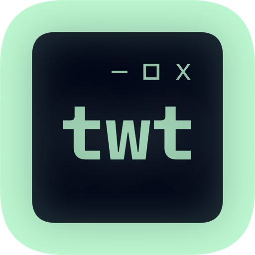

# twtGUI

twtGUI is a twtxt GUI client. it's kind of convenient for people like me who don't wan't to open cmd everytime and type

`twtxt timeline`

everytime. they can just open this app, look, and be done.

*screenshot from v0.1.0-alpha. design is **not** final.*

(i actually just made it because i was bored)

## status

twtGUI is Constantly being developed. here's some stuff i got working perfectly fine!!

- tweeting works fine
- viewing timeline works fine

and here's stuff i will work on:

- settings, you'll be able to configure/view stuff like:
  - the script you want to use to tweet (incase your `twtxt.txt` is in a git repo or something idk!)
  - config file, since twtxt doesn't have a command for getting the username i gotta have you set the config file path. Sorry! but from there i'll also be able to do cool things..
  - appearance, maybe like the layout of the site or the tweets. i know there will be two options:
    - default: this is the default
    - og: the layout twtxt uses when you do `twtxt timeline` for example
  - info, this is where you just view like whatever version of the app is, or what version of electron is, etc.
- following page, just viewing who you're following. this also could make unfollowing easier Somehow
- search page, put in a url that directs to someone's `twtxt.txt` file and see if it's there! if it is there you can view their profile. speaking of profiles..
- profile viewing, if you're not following them their name will just appear as a url (and also you gotta set a name for thhem sorry i can't do Anything about that)

yeah that's a Long list.

## requirements

you need,,,

- **[python](https://www.python.org/) >= 3.4.1**: needed to install twtxt
- **recent version of [pip](https://pip.pypa.io/en/stable/)**: also needed to install twtxt
- **[twtxt](https://twtxt.readthedocs.io/en/stable/), with everything set up properly**: to use the app
- **internet**: it's kinda obvious why

### compatibility

| OS | Version | Status |
|----|---------|--------|
| Windows | Windows 7 and later | Fully supported |
| macOS | Unknown | Haven't tested yet, most likely not supported |
| Linux | Unknown | Haven't tested yet, most likely not supported |

## compiling

if you'd like to compile the electron app (for whatever reason) follow These Steps!

### get everything you need installed on your machine

you'll need

- **[git](https://git-scm.com/downloads)**: cloning the repo
- **[node.js](https://nodejs.org/en)**: npm,, literally Everything
- you'll also need windows installed

### clone the repo

first, clone the repo to your machine:

    git clone https://github.com/taxevaiden/twtGUI.git

### install dependencies

make sure you have  installed. then, navigate to the project folder and run:

    npm install

### actually compiling now

this is where we compile the app. compiling is pretty simple i have it all set up and everything yeah yeah

currently, the config is set to compile for windows (and also macOS but uh too lazy to remove that)

anyways, to compile the app run:

    npm run make

this generates a .zip file with the .exe in it, located at `twtGUI/out/make/zip/win32/x64/`. to run the app, simply extract the .zip file somewhere, and open `twtgui.exe`

## testing + PLEASE help me

if you'd like to help me test this app out and maybe help out with compatibility for macOS/Linux:

### get everything you need installed on your machine (again)

you'll need

- **[git](https://git-scm.com/downloads)**: cloning the repo
- **[node.js](https://nodejs.org/en)**: dev servering,, npm, blah blah blah blah...

### clone the repo (again)

first, clone the repo to your machine:

    git clone https://github.com/taxevaiden/twtGUI.git

### install dependencies (again)

make sure you have  installed. then, navigate to the project folder and run:

    npm install

### start testing

#### development server

to start the app locally, run:

    npm run dev

this will start the development server. then it'll open up an electron window and you can mess around with it

if you would like to just host the development server to run in your browser, run:

    npm run start:dev

the default port is `8080`. in your browser, go to

    http://localhost:8080/

you can change the default port in `astro.config.mjs`.

> [!WARNING]
> if you find
>
>     "electron:dev": "cross-env NODE_ENV=development electron ."
>
> in the scripts in `package.json`, using it will open a new electron window, but it also won't display anything since the development server hasn't started,, and it'll also error because of that

#### building and then testing

you also have an option to build the astro site first, then open the electron window. it functions the same as the development server, but changes you make won't be live. to build and then test, run:

    npm run build:dev

when executed, the astro site will be built and then an electron window will open. if you would like to just open a window if you already built the astro site, run

    npm run electron

this will just open an electron window, no building here!

### and if you want to help out

edit the code as needed and open a pull request. i probably won't check the pull requests often but i'll still check. changes that are kind of pointless won't be merged (which will probably be unlikely since my code is terrible. pls someone help me :pray:)

## credits

- this app uses the [IBM Plex Mono](https://www.ibm.com/plex) font, licensed under the [Open Font License](https://opensource.org/licenses/OFL-1.1). the font includes modifications from the [BlexMono Nerd Font](https://github.com/ryanoasis/nerd-fonts).
